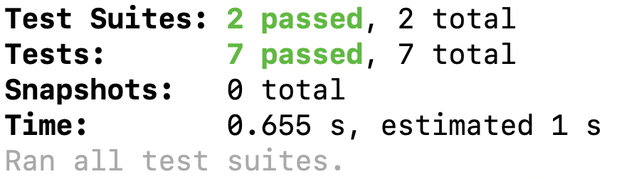

NOTE: There are 2 exercises. By the end, your terminal output should look like:



# Exercise 1

We have a function called `compareTo7` that returns a string. Your task is to test that it fulfills the following cases:

```
Returns correct result for numbers less than 7

Input: 5, Expected output: "5 is less than 7"
```

```
Returns correct result for numbers equal to 7

Input: 7, Expected output: "7 is equal to 7"
```

```
Returns correct result for numbers greater than 7

Input: 8, Expected output: "8 is greater than 7"
```

Create the directories and files:

```bash
mkdir testing_exercises
mkdir testing_exercises/__tests__
touch testing_exercises/compare_to_7.js
touch testing_exercises/__tests__/compareTo7.test.js
```

To run the tests:

```bash
npm test
```

Here is the function:

```js
function compareTo7(num) {
  if (num < 7) {
    return num + " is less than 7";
  } else if (num === 7) {
    return num + " is equal to 7";
  } else {
    return num + " is greater than 7";
  }
}

module.exports = compareTo7;
```

# Exercise 2

We have a function called `playRockPaperScissors` that returns a string. 

Create your files in the same directories as the previous exercise.

```bash
touch testing_exercises/rock_paper_scissors.js
touch testing_exercises/__tests__/rockPaperScissors.test.js
```

Your task is to test that it fulfills the following cases:

```
Test that it returns correct result for a tie

  Input: 'rock', 'rock' 
  Expected output: "It's a tie!"

  Input: 'paper', 'paper' 
  Expected output: "It's a tie!"

  Input: 'scissors', 'scissors' 
  Expected output: "It's a tie!"
```

```
Test that the function returns "Player 1 wins!" when player 1 chooses rock and player 2 chooses scissors or when player 1 chooses paper and player 2 chooses rock, or when player 1 chooses scissors and player 2 chooses paper

  Input: 'rock', 'scissors' 
  Expected output: "Player 1 wins!"

  Input: 'paper', 'rock' 
  Expected output: "Player 1 wins!"

  Input: 'scissors', 'paper' 
  Expected output: "Player 1 wins!"
```

```
Test that the function returns "Player 2 wins." when player 2 wins

  Input: 'scissors', 'rock' 
  Expected output: "Player 2 wins!"

  Input: 'rock', 'paper' 
  Expected output: "Player 2 wins!"

  Input: 'paper', 'scissors' 
  Expected output: "Player 2 wins!"
```

```js
function playRockPaperScissors(player1, player2) {
    // The possible choices for the game
    const choices = ['rock', 'paper', 'scissors'];
  
    // Determine the winner
    if (player1 === player2) {
      return "It's a tie!";
    } else if (
      (player1 === 'rock' && player2 === 'scissors') ||
      (player1 === 'paper' && player2 === 'rock') ||
      (player1 === 'scissors' && player2 === 'paper')
    ) {
      return 'Player 1 wins!';
    } else {
      return 'Player 2 wins.';
    }
}

module.exports = playRockPaperScissors;

```

To run the tests:

```bash
npm test
```