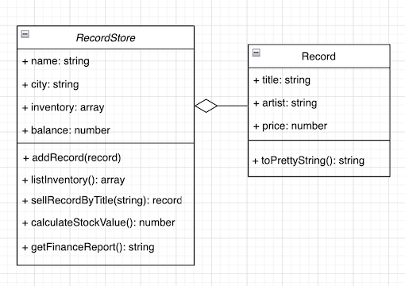

# TDD Exercise

We're opening a record store chain! We need some software to manage our stores and inventory.

Let's use Test-Driven Development to write this code.

- Write a test first - one that checks the program for a specific outcome.
- Run the test to make sure it fails.
- Write some code that passes the test.
- Repeat steps 1 - 3 for the remaining features of the program.
- Examine the code and test scripts, and refactor them to increase efficiency. Remember the DRY idea (Don't Repeat Yourself).



## Features

Here's our specification:

- All prices should be in pence
- We can assume that a `RecordStore` can get hold of as many copies of a record as they need assuming it's in the inventory 
- A `Record` object should return a pretty string in the format "Artist: The Shins, Title: Oh Inverted World, Price: 1000"
- A `RecordStore` object should start with an empty inventory and a balance of 0
- A `RecordStore` object should be able to add a `Record` to it's inventory
- A `RecordStore` object should be able to print an inventory in the following format:

```
**** INVENTORY ****
Artist: Nirvana, Title: Nevermind, Price: £9.99
Artist: Red Hot Chilli Peppers, Title: By The Way, Price: £7.99
```

- Given a record title, a `RecordStore` object should sell that record if it exists in the inventory
- A `RecordStore` object should return its entire stock value
- A `RecordStore` object should return a finance report in the format "Current Balance: 2000 Current Stock Value: 15000"